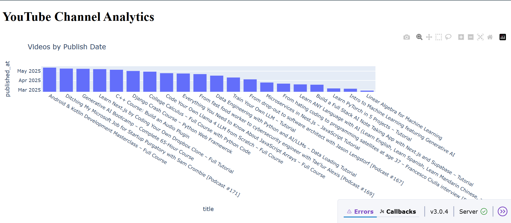

# 📊 YouTube Channel Analytics Dashboard

An interactive dashboard to analyze and visualize a YouTube channel performance using data pulled from the YouTube Data API.The YouTube channel that is being analyzed here is FreeCodeCamp. Built with Python, MongoDB Atlas, and deployed on Replit.



---

## 🚀 Project Features

- ✅ Channel performance overview (total views, subscribers, uploads)
- 📊 Interactive charts and metrics using Streamlit
- 🧠 MongoDB Atlas for storing and querying YouTube data
- 🔄 Real-time data updates via YouTube Data API v3
- 🌐 Free deployment using Replit + GitHub Student Developer Pack
- 📁 Clean code structure and reusable utility functions

---

## 🛠️ Tech Stack

| Technology       | Purpose                                 |
|------------------|------------------------------------------|
| Python           | Backend logic and data processing        |
| Streamlit        | Web app interface for dashboard display  |
| MongoDB Atlas    | NoSQL cloud database                     |
| YouTube Data API | Fetching channel and video analytics     |
| Replit           | Online IDE and app deployment            |
| GitHub Student Pack | Free access to MongoDB Atlas and Replit |

---

## 

## 🗂️ Project Structure

```bash
youtube-analytics-dashboard/
│
├── .replit              # Replit configuration for running the app
├── replit.nix           # Defines the system environment and dependencies on Replit
├── main.py              # Main application script (Streamlit or Flask)
├── requirements.txt     # Python packages needed to run the project
├── utils/               # Contains helper scripts for API requests, DB connection, etc.
│   ├── api_handler.py   # Manages YouTube API calls
│   └── db_utils.py      # MongoDB connection and CRUD functions
├── images/              # Screenshots or image assets for README/docs
│   └── dashboard_preview.png
└── README.md            # Project documentation
```
